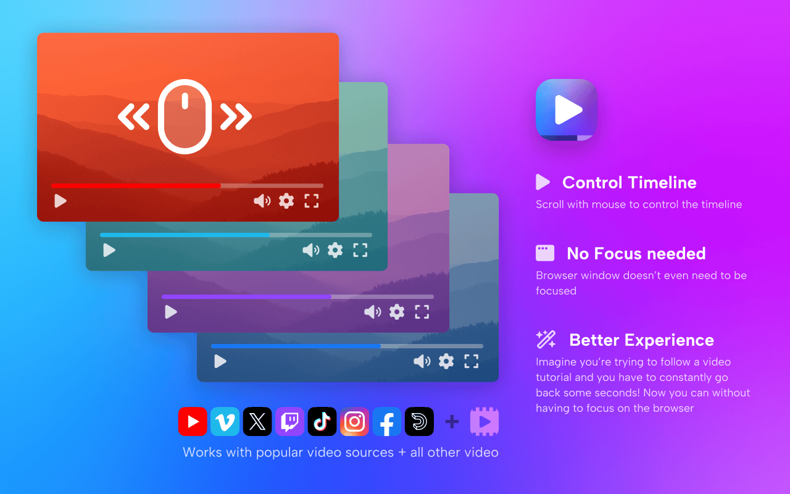

<div style="display: flex; align-items: center;">
  
  <h1 style="margin: 0;">Media Flow Seek</h1>
</div>

<br />



> **Control video playback timeline with horizontal mouse scroll - even when the browser isn't in focus!**

<p align="left">
  <a href="https://github.com/aPinix/chrome-extension-media-flow-seek">
    
  </a>
  <a href="LICENSE">
    
  </a>
  <a href="https://wxt.dev">
    
  </a>
  <a href="https://reactjs.org">
    
  </a>
  <a href="https://www.typescriptlang.org">
    
  </a>
</p>

## ✨ Features

### 🎯 **Universal Video Control**

- **Works on ALL websites** - YouTube, Vimeo, Twitch, Netflix, TikTok, Instagram, and any site with HTML5 video
- **Horizontal scroll to seek** - Use your mouse wheel to scrub through video timeline
- **Background control** - Works even when the browser tab isn't active or in focus

### 🎨 **Smart Visual Feedback**

- **Platform-specific colors** - Progress bars match each platform's brand colors
  - <span style="display: inline-block; width: 20px; height: 20px; border-radius: 50%; background-color: #ff0000; margin-right: 10px; vertical-align: middle;"></span><span style="font-weight: bold;">YouTube</span>: Red progress bar
  - <span style="display: inline-block; width: 20px; height: 20px; border-radius: 50%; background-color: #1ab7ea; margin-right: 10px; vertical-align: middle;"></span><span style="font-weight: bold;">Vimeo</span>: Blue progress bar
  - <span style="display: inline-block; width: 20px; height: 20px; border-radius: 50%; background-color: #9146ff; margin-right: 10px; vertical-align: middle;"></span><span style="font-weight: bold;">Twitch</span>: Purple progress bar
  - <span style="display: inline-block; width: 20px; height: 20px; border-radius: 50%; background-color: #e50914; margin-right: 10px; vertical-align: middle;"></span><span style="font-weight: bold;">Netflix</span>: Red progress bar
  - <span style="display: inline-block; width: 20px; height: 20px; border-radius: 50%; background-color: #0066cc; margin-right: 10px; vertical-align: middle;"></span><span style="font-weight: bold;">Dailymotion</span>: Blue progress bar
  - <span style="display: inline-block; width: 20px; height: 20px; border-radius: 50%; background-color: #1ce783; margin-right: 10px; vertical-align: middle;"></span><span style="font-weight: bold;">Hulu</span>: Green progress bar
  - <span style="display: inline-block; width: 20px; height: 20px; border-radius: 50%; background-color: #ff0050; margin-right: 10px; vertical-align: middle;"></span><span style="font-weight: bold;">TikTok</span>: Pink progress bar
  - <span style="display: inline-block; width: 20px; height: 20px; border-radius: 50%; background-color: #e4405f; margin-right: 10px; vertical-align: middle;"></span><span style="font-weight: bold;">Instagram</span>: Pink progress bar
  - <span style="display: inline-block; width: 20px; height: 20px; border-radius: 50%; background-color: #1877f2; margin-right: 10px; vertical-align: middle;"></span><span style="font-weight: bold;">Facebook</span>: Blue progress bar
  - <span style="display: inline-block; width: 20px; height: 20px; border-radius: 50%; background-color: #1da1f2; margin-right: 10px; vertical-align: middle;"></span><span style="font-weight: bold;">X (Twitter)</span>: Blue progress bar
- **Smooth timeline overlay** - Visual scrub bar appears during seeking
- **Responsive design** - Adapts to any video size and position

### ⚙️ **Customizable Settings**

- **Scroll direction inversion** - Reverse horizontal scroll direction for preferred control
- **Persistent settings** - Your preferences are saved across browser sessions
- **Real-time updates** - Settings apply immediately without page reload

### 🎛️ **Advanced Controls**

- **Precise seeking** - Scroll distance correlates to video duration for accurate control
- **Smooth transitions** - Optimized for responsive, lag-free scrubbing
- **Non-intrusive** - Overlay only appears during active scrubbing

## 🚀 Installation

### Chrome Web Store (Recommended)

[](https://chromewebstore.google.com/detail/media-flow-seek/phhigkiikolopghmahejjlojejpocagg)

**[Install from Chrome Web Store](https://chromewebstore.google.com/detail/media-flow-seek/phhigkiikolopghmahejjlojejpocagg)**

### Manual Installation (Developer Mode)

1. **Download the extension**:

   ```bash
   git clone https://github.com/aPinix/chrome-extension-media-flow-seek.git
   cd chrome-extension-media-flow-seek
   ```

2. **Install dependencies**:

   ```bash
   bun install
   # or
   npm install
   ```

3. **Build the extension**:

   ```bash
   bun run build
   # or
   npm run build
   ```

4. **Load in Chrome**:
   - Open `chrome://extensions/`
   - Enable "Developer mode"
   - Click "Load unpacked"
   - Select the `.output/chrome-mv3` folder

5. **For Firefox**:

   ```bash
   bun run build:firefox
   ```

   - Open `about:debugging`
   - Click "This Firefox"
   - Click "Load Temporary Add-on"
   - Select the manifest file from `.output/firefox-mv3`

## 🎮 Usage

### Basic Usage

1. **Navigate to any video** - YouTube, Vimeo, Netflix, or any website with video
2. **Hover over the video** - The invisible overlay is automatically active
3. **Scroll horizontally** - Use your mouse wheel or trackpad to seek through the timeline
4. **Visual feedback** - A colored progress bar appears showing your current position

### Settings

- **Click the extension icon** in your browser toolbar
- **Toggle "Invert horizontal scroll"** to reverse the scroll direction
- Settings are automatically saved and applied across all tabs

### Pro Tips

- **Works in background** - You can scrub videos even when the browser tab isn't focused
- **Multiple videos** - Automatically detects and controls the currently playing video
- **Responsive** - Works on fullscreen, embedded, and picture-in-picture videos

## 🛠️ Development

### Prerequisites

- [Bun](https://bun.sh/) or [Node.js](https://nodejs.org/) (18+)
- Modern browser with extension support

### Development Setup

```bash
# Clone the repository
git clone https://github.com/aPinix/chrome-extension-media-flow-seek.git
cd chrome-extension-media-flow-seek

# Install dependencies
bun install

# Start development server
bun run dev

# For Firefox development
bun run dev:firefox
```

### Available Scripts

- `bun run dev` - Start development server (Chrome)
- `bun run dev:firefox` - Start development server (Firefox)
- `bun run build` - Build for production (Chrome)
- `bun run build:firefox` - Build for production (Firefox)
- `bun run zip` - Create distribution zip (Chrome)
- `bun run zip:firefox` - Create distribution zip (Firefox)

### Tech Stack

- **🧩 WXT** - Modern web extension framework
- **⚛️ React 19** - UI library with latest features
- **📘 TypeScript** - Type-safe development
- **🎨 Tailwind CSS** - Utility-first styling
- **🔧 Vite** - Fast build tool
- **🧪 Vitest** - Unit testing framework

## 🎨 Architecture

### Content Script (`entrypoints/content.ts`)

- Detects video elements on all websites
- Creates invisible overlay for scroll detection
- Handles video seeking and visual feedback
- Manages platform-specific styling

### Popup Interface (`entrypoints/popup/popup.tsx`)

- Clean, modern UI with dark/light theme support
- Settings management with persistent storage
- Real-time communication with content script

### Background Script (`entrypoints/background.ts`)

- Handles extension lifecycle
- Manages cross-tab communication

## 🌟 Supported Platforms

| Platform            | Status | Progress Color |
| ------------------- | ------ | -------------- |
| YouTube             | ✅     | 🔴 Red         |
| Vimeo               | ✅     | 🔵 Blue        |
| Twitch              | ✅     | 🟣 Purple      |
| Netflix             | ✅     | 🔴 Red         |
| Hulu                | ✅     | 🟢 Green       |
| TikTok              | ✅     | 🩷 Pink        |
| Instagram           | ✅     | 🩷 Pink        |
| Facebook            | ✅     | 🔵 Blue        |
| Twitter/X           | ✅     | 🔵 Blue        |
| Dailymotion         | ✅     | 🔵 Blue        |
| **Any HTML5 Video** | ✅     | ⚪ White       |

## 🤝 Contributing

We welcome contributions! Here's how to get started:

1. **Fork the repository**
2. **Create a feature branch**: `git checkout -b feature/amazing-feature`
3. **Make your changes** and test thoroughly
4. **Commit your changes**: `git commit -m 'Add amazing feature'`
5. **Push to the branch**: `git push origin feature/amazing-feature`
6. **Open a Pull Request**

### Development Guidelines

- Follow the existing code style (Prettier + ESLint configured)
- Write tests for new features
- Update documentation as needed
- Test across multiple browsers and video platforms

## 📝 License

This project is licensed under the MIT License - see the [LICENSE](LICENSE) file for details.

## 👨‍💻 Author

**Pinix**

- LinkedIn: [@pinix](https://www.linkedin.com/in/pinix/)
- GitHub: [@aPinix](https://github.com/aPinix)

## 🙏 Acknowledgments

- Built with [WXT](https://wxt.dev) - Amazing web extension framework
- UI components from [Radix UI](https://radix-ui.com)
- Styled with [Tailwind CSS](https://tailwindcss.com)
- Icons from [Lucide React](https://lucide.dev)

---

<div align="center">

**⭐ Star this repository if you find it helpful!**

[Report Bug](https://github.com/aPinix/chrome-extension-media-flow-seek/issues) · [Request Feature](https://github.com/aPinix/chrome-extension-media-flow-seek/issues) · [Contribute](https://github.com/aPinix/chrome-extension-media-flow-seek/pulls)

</div>
